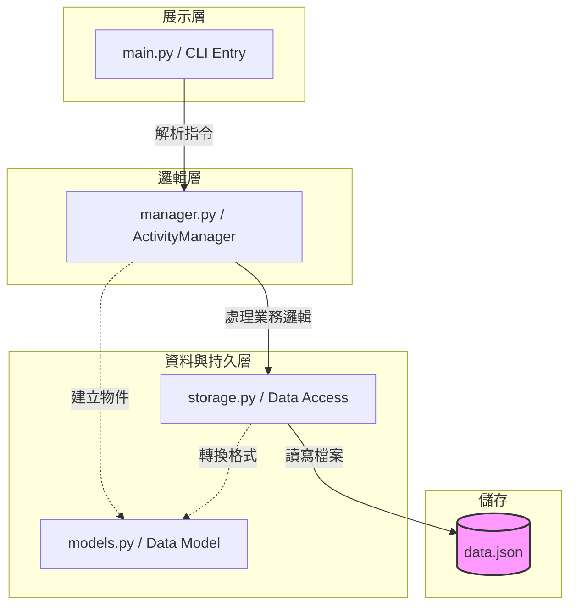

# sdd_v1.md - Balance Life CLI 規格文件

## 1. 專案概覽 (Project Overview)

- **程式名稱**：Balance Life CLI
- **版本**：v1.0
- **一句話描述**：一個飲食與運動完美平衡的數據紀錄工具。
- **目標使用者**：想要規律紀錄每日三餐內容與花費和運動內容與時長的使用者。
- **核心價值**：整合三餐花費與運動時長，建立個人的生活規律數據庫。

---

## 2. CLI 介面規格 (Interface Specification)

### `main.py <command> [options]`

| 指令 | 參數 | 說明 | 範例 |
|---|---|---|---|
| add | --name, --price, --type [B/L/D/S/W], --duration | 新增紀錄 (W 為運動) | python main.py add --type W --name "跑步" --duration 30 |
| list | --all, --date YYYY-MM-DD | 列出所有紀錄 | python main.py list --all |
| stats | --period [day/week] | 統計開銷與運動總時長 | python main.py stats --period week |
| delete | --id TEXT | 根據 ID 刪除紀錄 | python main.py delete --id a1b2c3 |

---

## 3. 資料模型 (Data Model)

資料儲存於 `data.json`。

### ActivityRecord (活動紀錄模型)
| 欄位 | 型別 | 說明 | 必填 |
|---|---|---|---|
| id | str | 唯一識別碼，採 UUID 前 6 碼。 | ✅ |
| category | str | B/L/D/S/W | ✅ |
| name | str | 食物或運動名稱 | ✅ |
| price | float | 金額 (運動紀錄時可為 0) | ✅ |
| duration_min | int | 運動分鐘數 (飲食紀錄時為 0) | ✅ |
| date | str | 發生日期 YYYY-MM-DD | ✅ |
| time | str | 發生時間 HH:MM | ✅ |

---

## 4. 模組架構 (Module Design)

---

## 5. 錯誤處理規格 (Error Handling)

| 情境 | 預期行為 | 退出碼 |
|---|---|---|
| 金額或時長為負數 | 輸出 Error: Value cannot be negative. | 1 |
| 格式錯誤 (日期/時間) | 輸出 Error: Invalid format. | 2 |
| 找不到指定 ID | 輸出 Error: Record ID not found. | 3 |
| JSON 檔案損毀 | 輸出 Error: Data file corrupted. | 4 |

---

## 6. 測試案例 (Test Cases)

| # | 輸入指令 | 預期輸出 | 通過條件 |
|---|---|---|---|
| 1 | python main.py add --type W --name "重訓" --duration 60 | Added: [ID] 重訓 (60 min) | stdout 含 "min" |
| 2 | python main.py add --type L --name "便當" --price 120 | Added: [ID] 便當 ($120) | stdout 包含 "$120" |
| 3 | python main.py stats --period day | Daily Total: $XXX, Workout: XX min | 顯示金額與時長 |
| 4 | python main.py add --type L --name "麵" --price -10 | Error: Value cannot be negative. | 退出碼 1 |
| 5 | python main.py delete --id 999999 | Error: Record ID 999999 not found. | 退出碼 3 |
