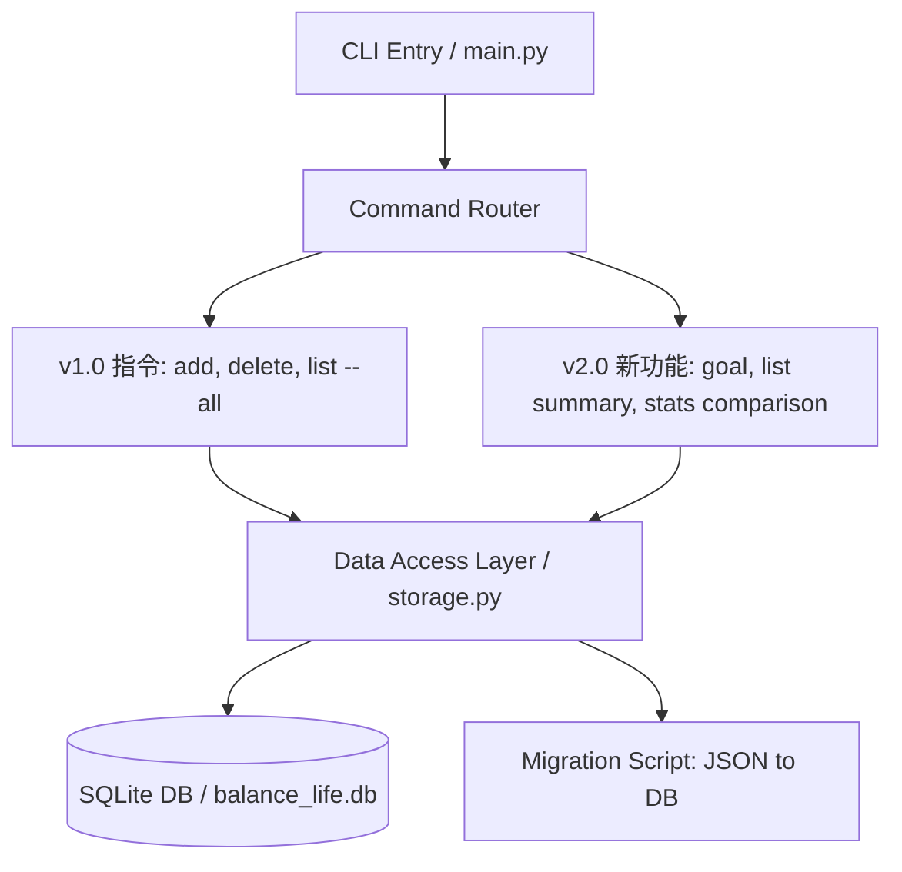
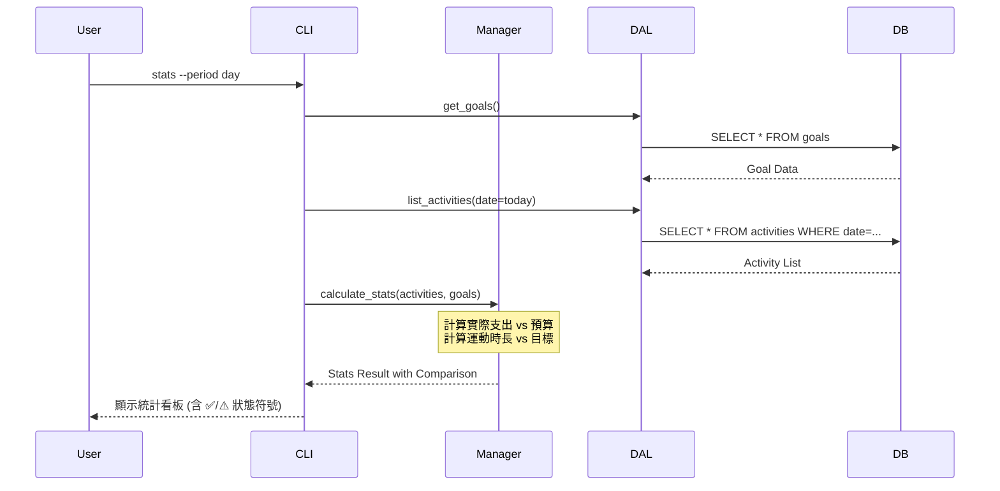

# Balance Life CLI v2.0 系統設計文件 (SDD)

**文件版本：** v2.0  
**作者：** yujouhsiao  
**日期：** 2026-03-28  
**基於版本：** v1.0

---

## 1. 系統概述
Balance Life CLI v2.0 旨在將原有的「飲食與運動紀錄工具」演進為「個人健康管理儀表板」。本版本引入了 SQLite 資料庫以提升查詢效能，並新增了個人化目標設定功能，讓使用者能直觀地對照每日預算與運動目標的達成情況。

---

## 2. 系統架構圖 (Architecture Diagram)

本系統採用分層架構，確保邏輯層與資料存取層分離，並支援從 JSON 到 SQLite 的自動資料遷移。

---

## 3. 資料模型 (Data Models)

### 3.1 ActivityRecord (活動紀錄)
* **id**: 唯一識別碼 (String, UUID 前 6 碼)
* **category**: 類別 (B/L/D/S/W)
* **name**: 名稱 (String)
* **price**: 金額 (Float, 預設 0.0)
* **duration_min**: 分鐘數 (Integer, 預設 0)
* **date**: 日期 (YYYY-MM-DD)
* **time**: 時間 (HH:MM)

### 3.2 Goal (個人目標) - v2.0 新增
* **daily_budget**: 每日飲食預算上限 (Float)
* **daily_workout_min**: 每日運動時長目標 (Integer)

---

## 4. 核心功能流程圖 (Sequence Diagram)

以下展示 v2.0 中最複雜的 `stats` 指令執行流程，包含跨表讀取與數據對照邏輯：

---

## 5. 指令規格 (Command Specifications)

| 指令 | 參數 | 說明 | 錯誤處理 |
| :--- | :--- | :--- | :--- |
| **goal** | `--budget`, `--workout` | 設定每日預算與運動目標 | 若值為負數，輸出錯誤並結束 (Exit Code 5) |
| **goal** | (無) | 查看目前已設定的目標 | 若未設定，顯示提示訊息 |
| **list** | `--type` | 按類別 (B/L/D/S/W) 篩選紀錄 | 若無紀錄，顯示提示訊息 |
| **list** | (預設今日) | 顯示今日各餐別小計與運動摘要 | 採分組格式輸出 (Requirement D) |
| **stats** | `--period` | 顯示實際數據與目標之對照 | 若無目標，行為回退至 v1.0 |

---

## 6. 向下相容性設計 (Backward Compatibility)

### 保留的 v1.0 介面
| v1.0 指令 | v2.0 行為 | 是否相容 |
| :--- | :--- | :--- |
| `add --name TEXT --type T` | 行為不變，內部改儲存至 SQLite | ✅ 完全相容 |
| `list --all` | 輸出原始流水帳格式，不變動現有欄位 | ✅ 完全相容 |
| `delete --id STRING` | 根據 UUID 刪除紀錄，邏輯維持不變 | ✅ 完全相容 |

### 破壞性變更 (Breaking Changes)
> 本版本無任何 Breaking Changes。所有 v1.0 定義的測試案例均能在 v2.0 執行環境下通過。

### 遷移策略 (Migration Strategy)
* **自動化遷移**：系統於啟動時偵測是否存在 `v2/data.json`。
* **資料轉移**：若偵測到舊資料，`storage.py` 將自動讀取並寫入 SQLite。
* **安全性備份**：遷移完成後，原 `data.json` 將更名為 `data.json.bak`。

---

## 7. 退出碼 (Exit Codes)
* **0**: 成功執行
* **1**: 一般輸入錯誤 (如負數紀錄)
* **3**: 找不到指定 ID 的紀錄
* **5**: 目標設定值非法 (v2.0 新增)