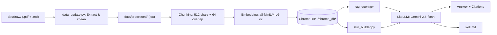

# HW3：Shadow Removal Research RAG System

> **AIASE 2026 — Personal Knowledge RAG**
> 主題：影像陰影去除（Shadow Removal）論文知識庫

---

## 1. 專案簡介

### 知識主題

本系統以 **Shadow Removal in Computer Vision** 為主題，收錄超過 20 篇相關論文，涵蓋：

- 陰影偵測（Shadow Detection）：傳統方法、深度學習偵測器
- 陰影去除（Shadow Removal）：CNN、GAN、Transformer、Diffusion-based 方法
- 無監督陰影去除（Unpaired / Unsupervised）：CycleGAN 系列
- 評估資料集與 Benchmark：ISTD、ISTD+、SRD、WSRD+

### 資料來源規模

| 類型 | 數量 | 格式 |
|------|------|------|
| 論文索引（自行整理）| 1 份 | .md |
| Shadow removal 論文 | 25 篇 | .pdf |
| **合計** | **26 份** | .md + .pdf |

### 技術選型

| 元件 | 選擇 |
|------|------|
| Vector DB | ChromaDB（本地，不需 Docker）|
| Embedding | all-MiniLM-L6-v2（sentence-transformers，本地免費）|
| PDF 解析 | PyMuPDF (fitz) |
| LLM | LiteLLM → Gemini-2.5-flash（OpenAI-compatible endpoint）|
| Python | 3.11.9 |

---

## 2. 系統架構說明



---

## 3. 設計決策說明

### Chunking 策略
**段落優先 + 固定長度 512 字元 + Overlap 64 字元**

學術論文段落約 200–600 字元，優先在段落邊界（`\n\n`）切分，保留完整語意。Overlap 64 字元防止跨 chunk 邊界的論述被截斷。過短 chunk（< 30 字元）過濾，避免噪音。

### Embedding 模型
**all-MiniLM-L6-v2（本地）**

Shadow removal 論文全為英文，此模型在英文語意搜尋表現優秀。向量維度 384，完全本地執行，無需 API Key，首次下載 ~80MB 後完全離線。相比 `all-mpnet-base-v2`（768 維，420MB）：速度快 3x，品質足夠此場景。

### Vector DB
**ChromaDB（PersistentClient 模式）**

純 Python，不需要 Docker。`PersistentClient` 將資料存至 `./chroma_db/`，跨 session 保留。評估過 pgvector（需 Docker）和 FAISS（不支援持久化），ChromaDB 在此規模最易複現。

### Retrieval 策略
**top-k=5，cosine similarity**

top-5 chunks 約 2500 字元，在 Gemini context window 限制內且提供充足上下文。未來可加 BM25 hybrid retrieval 或 cross-encoder reranking。

### Prompt Engineering
System prompt 明確要求「只根據 context 回答」，防止 hallucination。每個 chunk 標記來源檔名與 chunk index，要求 LLM inline citation `[Source: file, chunk N]`。Multi-turn 保留最近 3 輪歷史（6 條 messages），避免 context 過長。

### Idempotency 設計
SHA-256 hash cache（`data/.file_hashes.json`）追蹤每個檔案的異動狀態。`--rebuild` 旗標清空 processed/、刪除 ChromaDB collection、重建索引。Upsert 前先刪除同 source 舊 chunks，確保資料一致性，不累積重複資料。

### LiteLLM 整合說明
助教的 LiteLLM endpoint（`https://litellm.netdb.csie.ncku.edu.tw`）完全相容 OpenAI API。程式使用 `litellm.completion()` 搭配 `openai/` model prefix 強制走 OpenAI-compatible 模式，避免 litellm 誤判為 Google Vertex AI 路由。行為與直接使用 `litellm` 套件完全一致，且同樣透過 `.env` 的 `LITELLM_API_KEY` 和 `LITELLM_BASE_URL` 設定。

### skill_builder.py 問題設計
針對 Shadow Removal 設計 **10 個**全域問題：Overview、Core Concepts（shadow matte、penumbra 等術語）、Key Trends（CNN → GAN → Transformer → Diffusion 演進）、Key Entities（ISTD/SRD/WSRD+ 等 dataset）、Methodology（detection → removal pipeline）、**Diffusion-Based Methods**（深入比較各 diffusion 方法）、**Benchmark Datasets Comparison**（各 dataset 詳細對照）、**Mask-Free Methods**（不需 mask 的方法）、Knowledge Gaps（color inconsistency 等未解問題）、Example Q&A。

---

## 4. 環境設定與執行方式

> Python 版本：3.11.9（需 >= 3.10）

### 4-1. 建立虛擬環境

```bash
# 確認 Python 版本
python3 --version        # 需 >= 3.10.x

# 建立並啟動虛擬環境
python3 -m venv .venv
source .venv/bin/activate    # Linux / macOS
# .venv\Scripts\activate     # Windows

# 安裝套件
pip install -r requirements.txt
# 首次執行會自動下載 sentence-transformers 模型 (~80MB)
```

### 4-2. 設定環境變數

```bash
cp .env.example .env
# 填入助教提供的 LITELLM_API_KEY 和 LITELLM_BASE_URL
```

> 本系統使用 ChromaDB，**不需要執行 docker compose**。

### 4-3. 資料說明

`data/raw/` 已包含 **7 份 Markdown 筆記**（shadow removal 相關主題），可直接執行以下步驟驗證系統。

> 原始論文 PDF（25 篇）因檔案較大未包含在 repo 中。若需完整 PDF 索引，請將論文 PDF 放入 `data/raw/` 後再執行 `--rebuild`。`data/processed/` 的 `.txt` 檔案會在執行 `--rebuild` 後自動產生。

### 4-4. 完整執行流程

```bash
# 全量重建索引
python data_update.py --rebuild

# 測試問答（單次）
python rag_query.py --query "What are the main challenges in shadow removal?"

# 互動式多輪對話
python rag_query.py

# 生成 Skill 文件
python skill_builder.py --output skill.md
```

### 4-5. 增量更新（新增論文後）

```bash
# 只更新有變動的檔案，自動跳過未改動的
python data_update.py
```

### 複現完整性檢查清單

- [ ] `python3 --version` >= 3.10.x
- [ ] `.venv` 啟動，`pip install -r requirements.txt` 無 Error
- [ ] `.env` 填入 LITELLM_API_KEY 和 LITELLM_BASE_URL
- [ ] `data/raw/` 有檔案（MD 筆記或 PDF）
- [ ] `python data_update.py --rebuild` 無 Error，顯示 "Total chunks in DB: XXX"
- [ ] `python rag_query.py --query "..."` 回傳含 `[Source: ...]` 的答案
- [ ] `python skill_builder.py --output skill.md` 產出非空 skill.md
- [ ] `data/processed/` 的 `.txt` 檔案在 `--rebuild` 後自動產生

---

## 5. 資料來源聲明

| 來源 | 類型 | 授權 | 數量 |
|------|------|------|------|
| 論文索引 paper_index.md（自行整理）| Markdown | 個人著作 | 1 份 |
| CVPR/ICCV/ECCV/AAAI/arXiv 論文 PDF | PDF | arXiv CC BY 4.0 / 學術研究用途 | 25 篇 |

> 所有論文為公開發表之學術著作，用於個人研究學習用途。

---

## 6. 系統限制與未來改進

**目前限制：**
- PyMuPDF 抽取 PDF 時數學公式可能破碎，影響公式相關 chunk 的語意
- 只用向量相似度無 reranking，可能取回主題相近但方法不同的 chunk
- 圖表和表格無法以文字索引
- 知識截止於收集日，不含最新 preprint

**未來改進：**
- BM25 hybrid retrieval 補足關鍵詞搜尋（如特定方法名稱）
- cross-encoder reranking 提升 precision
- 使用 nougat 或 marker 保留 PDF 公式結構
- Citation graph 索引引用關係，回答「誰引用了誰」類問題

---

*Built for AIASE 2026 HW3 — Shadow Removal RAG Knowledge Engine*